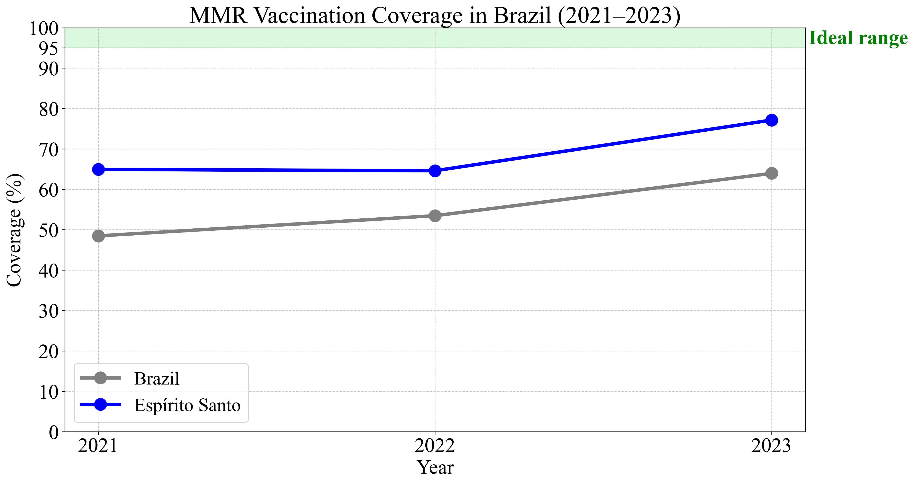
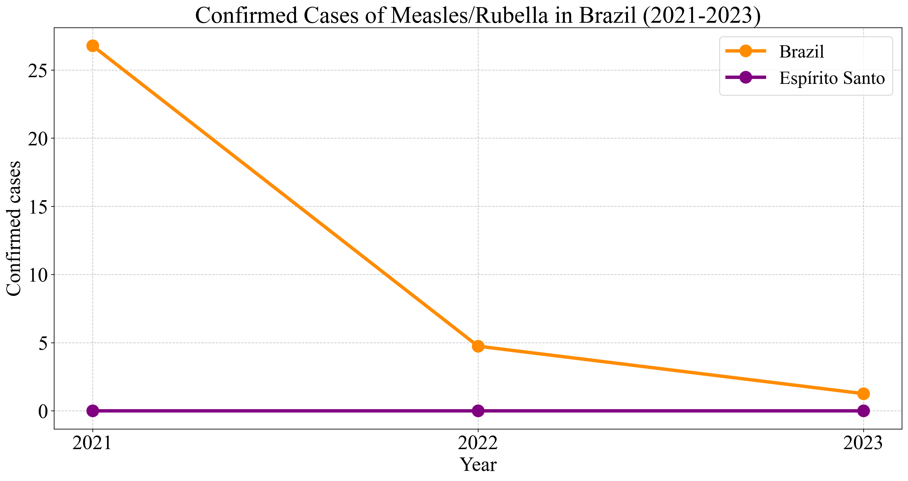
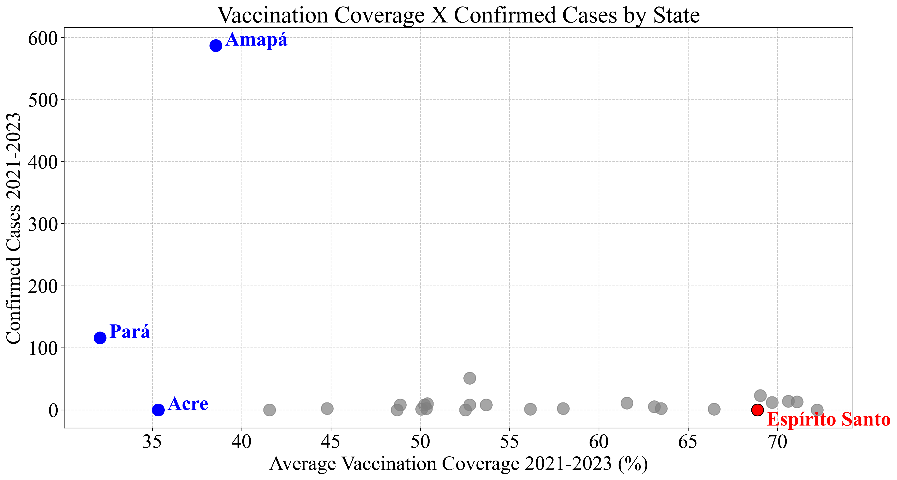
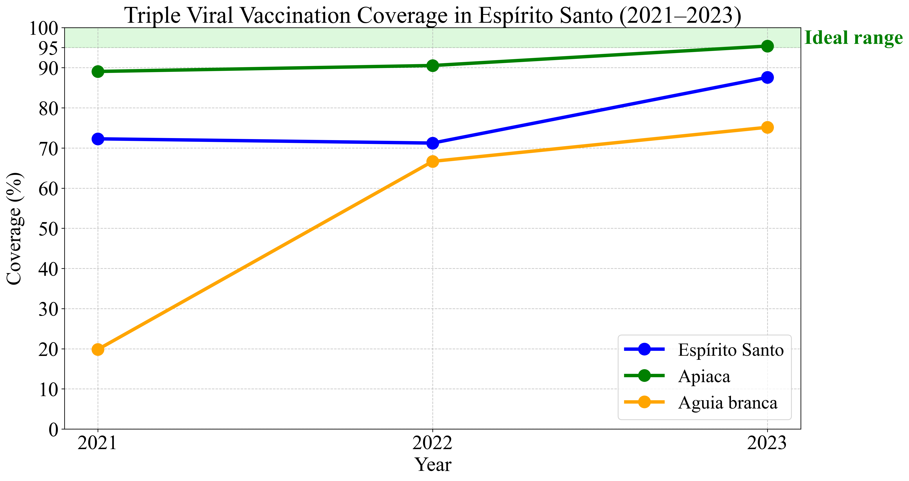
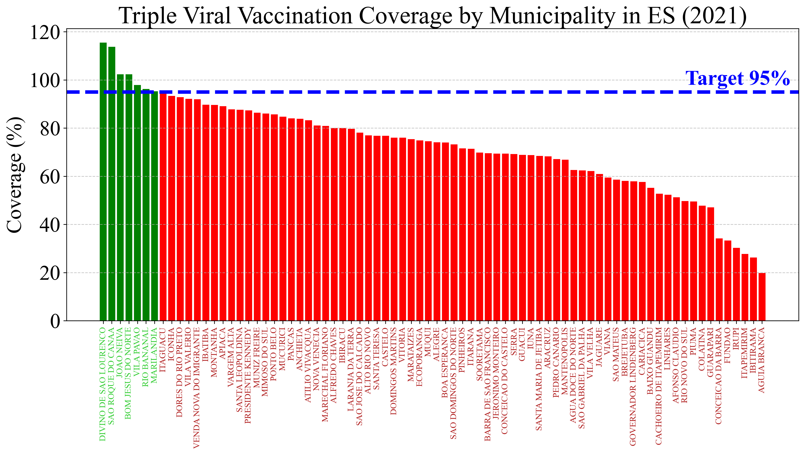
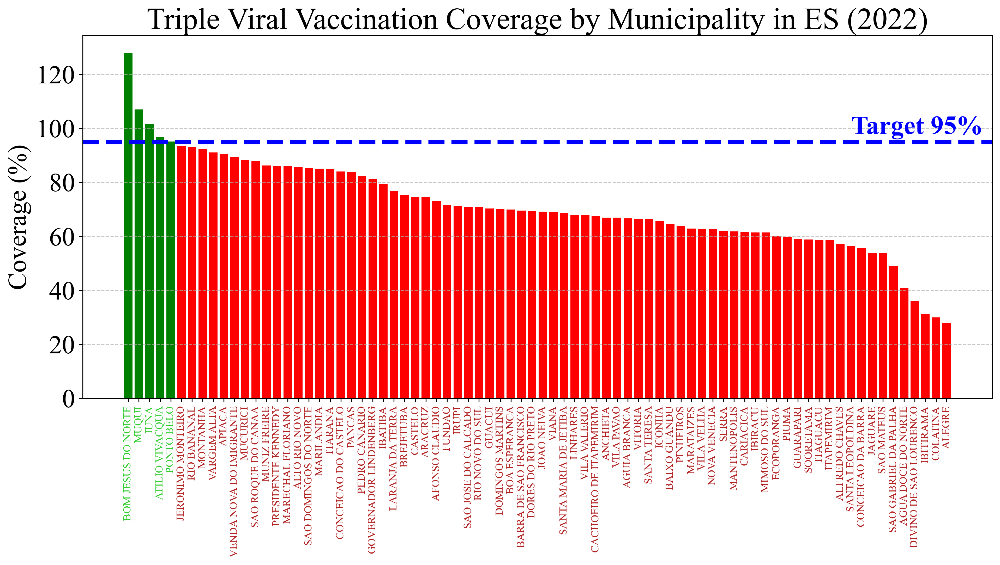
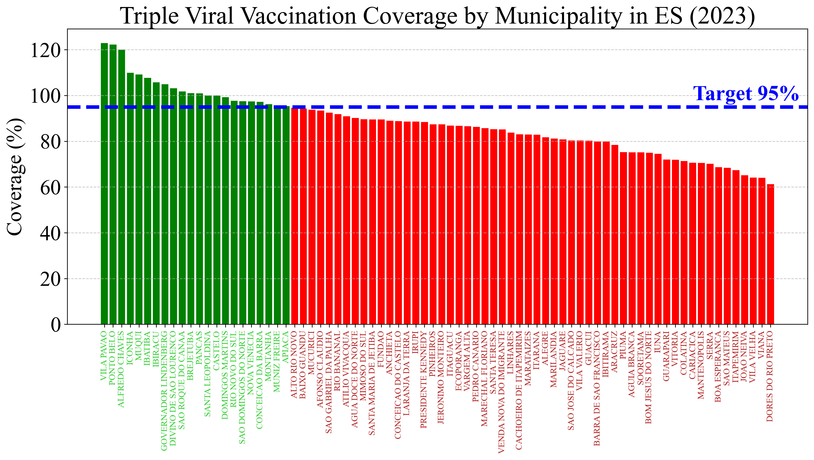

# Analysis of Vaccination Coverage in Espírito Santo, Brazil

## Introduction

This project investigates vaccination coverage against exanthematous diseases in different regions of Espírito Santo, Brazil, between 2021 and 2023, focusing on the MMR vaccine (measles, mumps, and rubella).  
These diseases are viral, highly contagious, and frequently encountered in medical practice, particularly among pediatric patients, posing significant public health challenges.

## Objectives

The main objective is to analyze vaccination coverage for vaccine-preventable rash diseases, focusing on measles and rubella, in Brazil and Espírito Santo.  
The analysis considers regional profiles and seeks to relate the decline in coverage to the increase in the number of confirmed cases.

## Methodology

This is a retrospective, quantitative, and descriptive study covering the years 2021, 2022, and 2023.  
Data were collected from the following sources:
- **DATASUS**
- **Tabnet**

The analyses were implemented in **Python**, using libraries such as:
- `pandas` for data manipulation
- `matplotlib` for visualization

---

## Data Structure

The dataset is organized into three `.csv` files located in the `data/` folder:

### 1. `vaccination_coverage_brazil.csv`
```csv
uf,2021,2022,2023
Rondônia,42.14,48.34,60.54
Acre,25.95,37.33,42.71
Amazonas,44.70,48.78,52.62
...
```

### 2. `vaccination_coverage_es.csv`
```csv
city,2021,2022,2023
AFONSO CLAUDIO,51.32,73.23,93.41
AGUIA BRANCA,19.84,66.67,75.16
AGUA DOCE DO NORTE,62.63,40.98,90.12
...
```

### 3. `confirmed_cases_brazil.csv`
```csv
uf,2021,2022,2023
Rondônia,0,2,0
Acre,0,0,0
Amazonas,0,0,0
...
```

---

## Results

Below are the main figures summarizing the analysis. All images are available in the `figures/` folder.

### National Overview

**Vaccination Coverage in Brazil (2021-2023)**
<p align="center">
    
</p>

**Confirmed Cases in Brazil (2021-2023)**
<p align="center">
    
</p>

**Coverage vs. Cases in Brazil**
<p align="center">
    
</p>

---

### Espírito Santo Overview

**Vaccination Coverage in Espírito Santo (2021-2023)**
<p align="center">
    
</p>

---

### Espírito Santo Cities by Year

**Coverage by City (2021)**
<p align="center">
    
</p>

**Coverage by City (2022)**
<p align="center">
    
</p>

**Coverage by City (2023)**
<p align="center">
    
</p>


